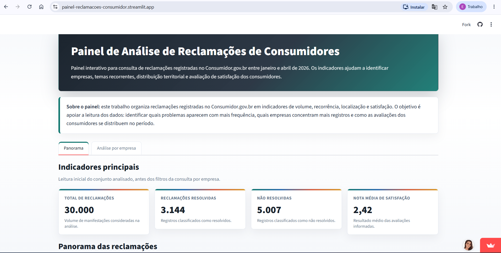
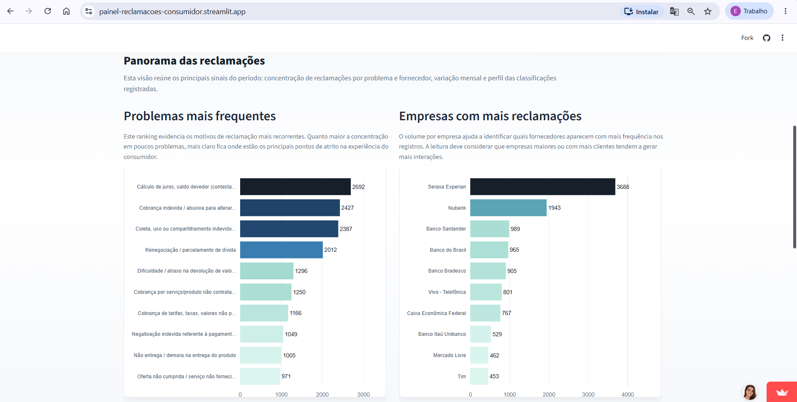
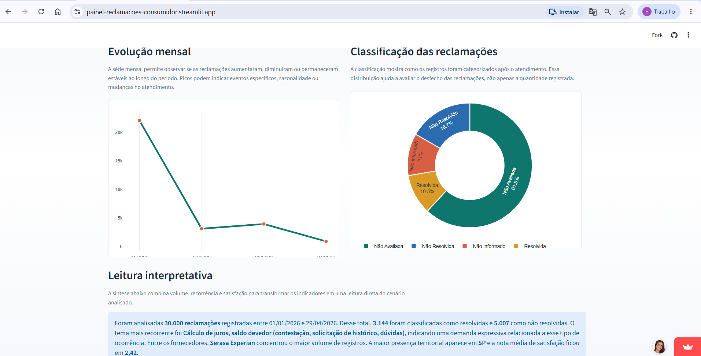
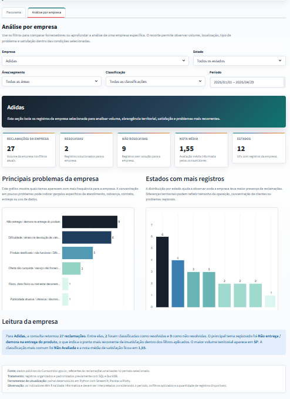

# Painel de Reclamações de Consumidores

🔗 **Acesse o painel online:**  
[https://painel-reclamacoes-consumidor.streamlit.app/](https://painel-reclamacoes-consumidor.streamlit.app/)

## Sobre o projeto

Este projeto apresenta um painel interativo para análise de reclamações de consumidores registradas no **Consumidor.gov.br**.

A proposta é transformar dados tratados em uma visualização clara e interpretativa, permitindo acompanhar volume de reclamações, resolução dos casos, nota média de satisfação, principais problemas relatados e comportamento das reclamações por empresa, estado, área de mercado, classificação e período.

O painel foi desenvolvido para facilitar a leitura dos dados por pessoas técnicas e não técnicas, evitando que a análise fique restrita a planilhas ou consultas manuais.

## Demonstração do painel

### Tela inicial e indicadores principais

A tela inicial apresenta uma introdução ao painel e os principais indicadores do período analisado: total de reclamações, quantidade de reclamações resolvidas, quantidade de reclamações não resolvidas e nota média de satisfação.

Esses indicadores funcionam como uma visão rápida do cenário antes de aprofundar a análise em gráficos ou filtros específicos.



### Panorama das reclamações

Na aba **Panorama**, o painel apresenta os problemas mais frequentes e as empresas com maior volume de reclamações.

Essa visualização ajuda a identificar os principais pontos de atrito relatados pelos consumidores e quais fornecedores aparecem com maior concentração de registros.



### Evolução mensal e classificação

Ainda na aba **Panorama**, o painel mostra a evolução mensal das reclamações e a distribuição das classificações.

A evolução mensal permite observar variações no volume de registros ao longo do tempo. Já a classificação indica o desfecho das reclamações, separando casos resolvidos, não resolvidos, não avaliados e sem informação.



### Análise por empresa

Na aba **Análise por empresa**, é possível selecionar uma empresa específica e aplicar filtros por estado, área/segmento, classificação e período.

Essa análise detalha o desempenho da empresa selecionada, mostrando volume de reclamações, quantidade de casos resolvidos e não resolvidos, nota média, distribuição territorial e principais problemas relatados.



## O que o painel permite analisar

- Total de reclamações registradas
- Quantidade de reclamações resolvidas
- Quantidade de reclamações não resolvidas
- Nota média de satisfação dos consumidores
- Empresas com maior volume de reclamações
- Reclamações por estado
- Reclamações por área/segmento
- Ranking dos principais problemas relatados
- Evolução mensal das reclamações
- Comparativo entre empresas
- Resumo interpretativo dos problemas mais frequentes

## Funcionalidades

O painel possui duas áreas principais:

### Panorama

Apresenta uma leitura ampla do período analisado, reunindo indicadores principais, ranking de problemas, empresas com mais reclamações, evolução mensal e distribuição das classificações.

### Análise por empresa

Permite consultar uma empresa específica ou comparar todas as empresas dentro de um recorte. Os filtros disponíveis são:

- Empresa
- Estado
- Área/segmento
- Classificação
- Período

## Fonte dos dados

Os dados utilizados são públicos e têm origem no **Consumidor.gov.br**.

Antes da construção do painel, os registros foram tratados para padronizar campos, organizar datas, ajustar classificações e permitir a geração dos indicadores.

## Tecnologias utilizadas

- Python
- Streamlit
- Pandas
- Plotly

## Como executar localmente

Clone o repositório:

```bash
git clone https://github.com/Esther-Nacimento/painel_reclamacoes_consumidor.git
```

Acesse a pasta do projeto:

```bash
cd painel_reclamacoes_consumidor
```

Instale as dependências:

```bash
pip install -r requirements.txt
```

Execute o painel:

```bash
streamlit run app.py
```

## Estrutura do projeto

```text
painel_reclamacoes_consumidor/
├── app.py
├── requirements.txt
├── README.md
├── dados/
│   └── reclamacoes_painel.csv
└── docs/
    └── imagens/
        ├── 01-tela-inicial.png
        ├── 02-panorama-rankings.png
        ├── 03-evolucao-classificacao.png
        └── 04-analise-empresa.png
```

## Observação

Os indicadores têm finalidade informativa e devem ser interpretados considerando o período analisado, os filtros aplicados e a quantidade de registros disponíveis.
